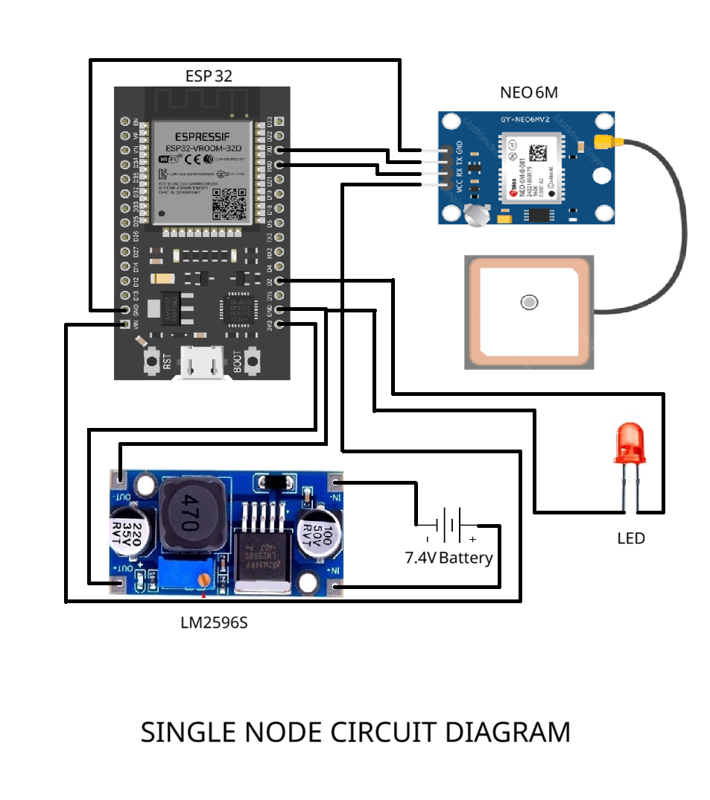

# Decentralized ESP32 Mesh Framework

A robust, FreeRTOS-based mesh networking framework for ESP32 devices utilizing the ESP-NOW protocol. This framework provides an advanced layer over standard ESP-NOW, offering reliable multi-hop routing, packet fragmentation, hardware-accelerated cryptographic signing, and an interactive Command Line Interface (CLI).

## Features

- **High-Performance Transport**: Built on top of Expressif's low-latency ESP-NOW protocol.
- **Advanced Multi-Hop Routing**: Features a dynamic `NodeRegistry` and `RouteCache` that allows messages to traverse intermediate nodes. It implements **Symmetric Reverse Routing**—automatically caching and reusing the exact path a packet took to get to you for sending the response back, drastically reducing network flooding.
- **Directional Routing**: Integrates GPS location data (via `GPSLocationProvider`) enabling directional routing optimizations. Instead of flooding the entire network, packets are intelligently routed geographically towards the physical coordinates of the destination node.
- **Robust Task Architecture**: Designed specifically for the ESP32 dual-core processor using FreeRTOS. Network intensive tasks (Receiver, Dispatcher, Sender, Discovery, Health) are carefully pinned to cores to prevent hardware interrupts and watchdog panics.
- **Packet Fragmentation**: Automatically fragments and reassembles large payloads seamlessly, overcoming ESP-NOW's 250-byte limit.
- **Reliability Layers**: Supports standard "fire-and-forget" UDP-style messages and reliable TCP-style request/response messages with built-in acknowledgment (`AckManager`) and retries.
- **Security**: Hardware-accelerated packet signing using `mbedtls` (HMAC SHA-256) to ensure data integrity and prevent spoofing.
- **Interactive CLI**: Includes `MeshTerminal`, a fully interactive serial console to explore the network, send targeted messages, and trigger broadcasts directly from the Arduino IDE Serial Monitor. It can also be called programmatically for custom processing.

## Architecture Highlights

The framework relies on a multi-tasking architecture:

- **ReceiverTask**: High priority. Hooks directly into the ESP-NOW receive callback to quickly pull raw packets into the framework's queues.
- **DispatcherTask**: Medium priority. Processes incoming packets, verifies cryptographic signatures, handles routing logic (forwarding), and dispatches user payloads to the event bus.
- **SenderTask**: Medium priority. Pulls from priority-tiered outgoing queues, processes MAC lookups, handles broadcast logic, and pushes packets to the ESP-NOW hardware driver.
- **DiscoveryTask & HealthTask**: Low priority background tasks that periodically broadcast presence beacons and prune stale/dead nodes from the routing cache.

## Hardware Setup

To build a physical node for this mesh framework, you will need an ESP32, a GPS module (like the NEO-6M), and a basic LED for testing remote commands. Power can be supplied via a battery and buck converter.



*The diagram above shows the standard wiring for a single mesh node.*

## Usage Overview

### Getting Started

Include the framework in your Arduino sketch and initialize the core components:

```cpp
#include <MeshFramework.hpp>

#define GPS_RX_PIN 16
#define GPS_TX_PIN 17

mesh::Mesh meshNode;
mesh::MeshTerminal terminal(meshNode);
mesh::GPSLocationProvider gps(GPS_RX_PIN, GPS_TX_PIN, 9600, 2);

void setup() {
    Serial.begin(115200);

    // Configure the mesh
    meshNode.setMaxPeers(20)
            .setNetworkKey((const uint8_t*)"MySecretMeshKey!", 16)
            .setLocationProvider(&gps);

    // Initialize hardware and start FreeRTOS tasks
    meshNode.init();
    meshNode.start();
}

void loop() {
    // Process internal event bus
    meshNode.getEventBus().processOne(0);
    
    // Process Serial CLI
    terminal.processSerial();
}
```

### CLI Terminal Commands

Once running, you can interact with the mesh via the Serial Monitor. You can also programmatically pass commands to the terminal using `terminal.execute("command", true)` which returns the output as a `String` (useful for custom processing) instead of printing directly to Serial.

- `ls` : List all discovered nodes (Hash, MAC, GPS coords, Last Seen).
- `broadcast <text>` : Broadcast a message to all nodes in range.
- `msg <hash> <text>` : Send a standard UDP message to a specific node hash.
- `tcp <hash> <text>` : Send a reliable TCP request requiring an acknowledgment.
- `geo <lat> <lon> <text>` : Send a geographically routed message towards a specific coordinate.
- `help` : Show the interactive help menu.

## Recent Stability Improvements

- **Heap Memory Management**: Large data allocations (e.g., payload fragment buffers) are strictly processed on the heap to prevent FreeRTOS stack-smashing and subsequent Semaphore/Mutex corruption panics.
- **Thread Safety**: Eliminates RTOS priority-inversion deadlock loops during ESP-NOW hardware baseband transmissions.

## Dependencies

- Requires **ESP32 Arduino Core**
- Hardware: ESP32 Dev Module (or similar). Compatible with NEO-6M / standard GPS modules.

## License

MIT License
